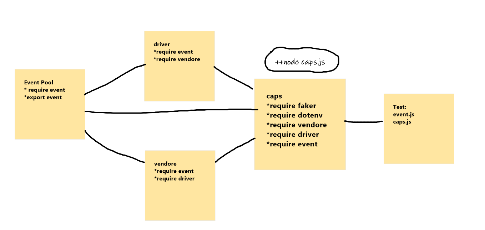

# caps

## Author: Osama Momani
 
 * [tests report](https://github.com/Osamamomani1/caps/actions)

***
## Description :

* create caps-app
***
## process output

* **vendor** 
* **driver**
* **caps**

***

## test

* Unit Tests: npm run test

## UML

    